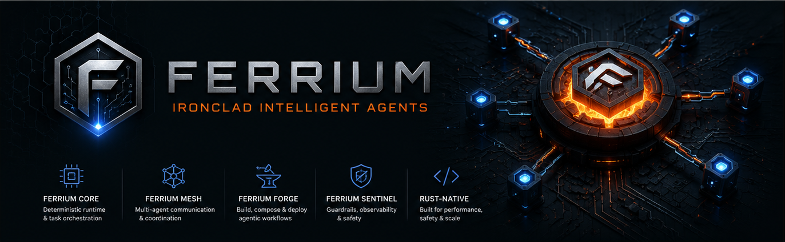

  

# Ferrium
#### Ironclad Intelligent Agents!

## Introduction

__Ferrium__ is a Rust-native platform for building reliable, autonomous, and composable agentic systems.

It is designed from the ground up to ensure:

- Deterministic execution
- Fault-tolerant orchestration
- High-performance concurrency
- Production-grade safety

Ferrium enables developers to move beyond experimental AI and build ironclad intelligent agents that operate predictably at scale.

## Philosophy

Most AI systems optimize for capability.
Ferrium optimizes for reliability + capability.

If agents are going to run critical workflows, they must be:
- predictable
- observable
- controllable
- safe under failure

Ferrium brings systems engineering discipline to agentic AI.

## Key Capabilities
* Multi-Agent Orchestration
Coordinate complex workflows across independent agents
* Composable Architectures
Build modular, reusable agent systems
* Resilient Execution
Designed to handle failures without cascading breakdowns
* High Performance
Leverages Rust for speed, safety, and concurrency
* Production Readiness
Built for real-world deployment, not just experimentation

## Design Principles
* Ironclad by Design → Safety and reliability are non-negotiable
* Composable Systems → Small building blocks, powerful outcomes
* Deterministic Behavior → Predictability over randomness
* Scalable Architecture → From single node to distributed systems
* Developer First → Ergonomic and extensible

